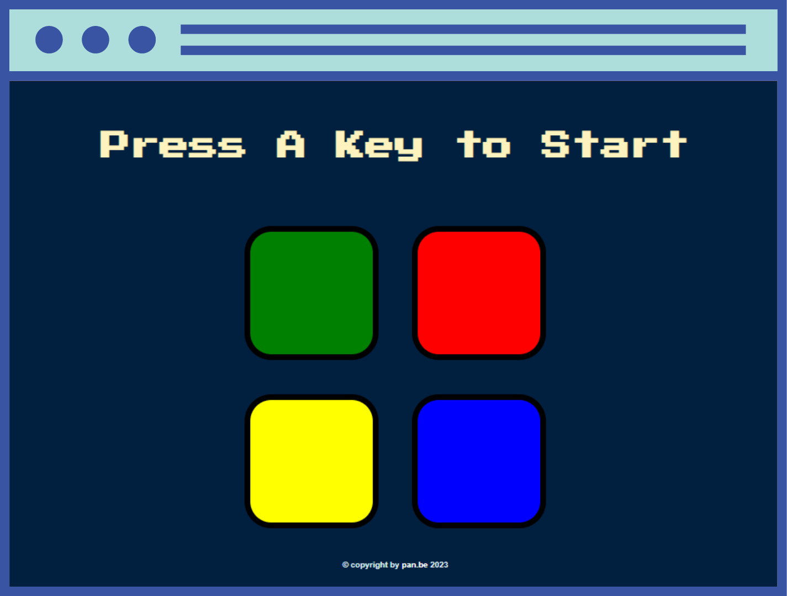

# Simon Game

## Description
Simon Game is a memory-based game where players need to remember and repeat a sequence of displayed colors. The game is implemented using jQuery.

## Features
- Randomly generated color sequences for each level
- Increasing difficulty with each level
- Interactive buttons to select and repeat the sequence
- Sound effects for each button press
- Score tracking

## Technologies Used
- HTML
- CSS
- JavaScript
- jQuery

## Demo
[Link to live demo](https://pan-be-simon-game.netlify.app)

## Installation
1. Clone the repository: `git clone https://github.com/your-username/Simon.git`
2. Navigate to the project directory: `cd Simon`
3. Open the index.html file in your preferred web browser.

## Usage
- Press any button to begin the game.
- Watch and remember the sequence of colors displayed.
- Click the buttons in the same order as the sequence.
- If you make a mistake, the game will end.
- Try to achieve the highest score by completing as many levels as possible.

## Contributing
Contributions are welcome! If you find any bugs or have suggestions for improvements, please open an issue or submit a pull request.

## License
This project is licensed under the [MIT License](link_do_licencji).
